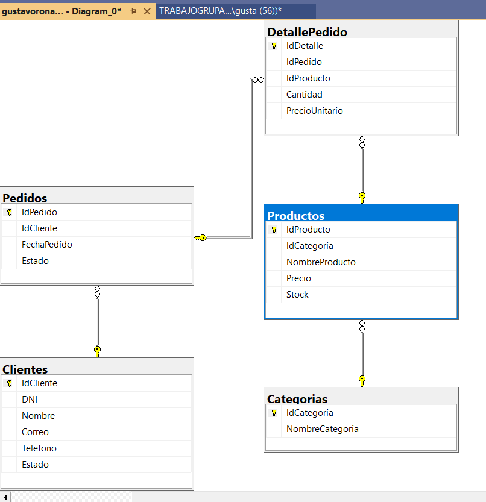
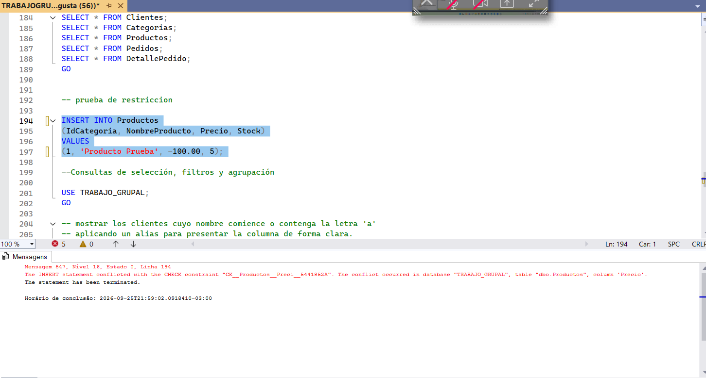

# Programación Avanzada DB

**Evaluación:** PA1 Proceso de Aprendizaje 1

**Curso:** Programación Avanzada de Base de Datos (30627)

**Enlace al Repositorio en GitHub:** [GitHUB GRUPO 3](https://github.com/GustavoRonaldinho67/Programacion-Avanzada-DB)

## Objetivo

El objetivo de este proyecto es diseñar, desarrollar e implementar un modelo físico coherente en Microsoft SQL Server que permita administrar los datos de una organización (clientes, productos y pedidos). Además, se busca evidenciar la capacidad técnica para obtener información útil mediante el uso de consultas simples, agrupadas, multitabla y subconsultas justificadas, aplicando buenas prácticas y cumpliendo con las restricciones de integridad.

## Integrantes y Roles

- **Gustavo Muñoz:** Responsable del diseño del modelo físico, DDL y validación de restricciones (Actividad 1).

- **Leandro:** Análisis inicial de consultas de selección (Actividad 2).

- **Mauricio Rojas:** Optimización técnica de la Actividad 2, y desarrollo integral de consultas multitabla (Actividad 3) y subconsultas/EXISTS (Actividad 4).

## Desarrollo y Solución Propuesta

### Actividad 1: Modelo físico y restricciones

**Responsable:** Gustavo Muñoz

Se implementó el modelo físico de la base de datos en SQL Server, transformando el requerimiento organizacional en entidades relacionales (`Clientes`, `Categorias`, `Productos`, `Pedidos`, `DetallePedido`).

- Se definieron correctamente las tablas, relaciones y tipos de datos.

- Se utilizaron restricciones como `PRIMARY KEY`, `FOREIGN KEY`, `NOT NULL`, `UNIQUE`, `DEFAULT` y `CHECK` para controlar y validar la información almacenada, garantizando la integridad referencial.

- Se insertaron registros base y se documentó la validación de la restricción `CHECK` (impidiendo la inserción de precios o stock negativos).

**Evidencia Técnica:**

El modelo físico representa la estructura de la base de datos, mostrando las tablas, sus atributos, claves primarias, claves foráneas y las relaciones existentes entre ellas.

**Validación de restricciones:**
Se realizaron pruebas de inserción para verificar que las restricciones establecidas funcionen correctamente, especialmente la restricción CHECK. En la siguiente evidencia, el motor de SQL Server bloquea la inserción de un producto con precio negativo (-100.00).

### Actividad 2: Consultas de selección, filtros y agrupación

**Responsables:** Leandro (Análisis) / Mauricio Rojas (Optimización Técnica)

Se implementaron consultas estructuradas para auditar el inventario y la facturación de la organización, cumpliendo estrictamente con el uso de funciones escalares y de agrupación.

- **Requerimiento 1:** Uso de funciones escalares (`UPPER`, `ROUND`), operaciones aritméticas y filtros restrictivos (`IN`, `LIKE`, `BETWEEN`) para determinar el valor bruto y el precio con IGV de productos específicos de las categorías de Tecnología y Accesorios.

- **Requerimiento 2:** Implementación de funciones de agregación (`SUM`, `COUNT`) sobre la tabla transaccional `DetallePedido`, utilizando `GROUP BY` y la cláusula `HAVING` para aislar pedidos de alta rentabilidad (superiores a 200.00).

### Actividad 3: Consultas multitabla y consolidación de resultados

**Responsable:** Mauricio Rojas

Se resolvieron requerimientos analíticos combinando registros de múltiples tablas sin perder la relación entre las entidades.

- **Uso de OUTER JOIN y CASE:** Se utilizó un `LEFT OUTER JOIN` desde la tabla `Clientes` hacia `Pedidos` para garantizar que el negocio visualice a toda su cartera de clientes, incluyendo aquellos que aún no tienen transacciones registradas. La estructura `CASE` permite clasificar automáticamente a los clientes en 'VIP', 'Regular' o 'Prospecto' basándose en su volumen histórico de compras, facilitando la toma de decisiones del área comercial.

- **Uso de UNION:** Se integró el operador `UNION` para fusionar dos consultas excluyentes sobre el `Stock` de la tabla `Productos`, generando un reporte unificado que clasifica de forma dicotómica el inventario entre "Crítico (Requiere Reposición)" y "Óptimo".

### Actividad 4: Subconsultas y contraste de alternativas

**Responsable:** Mauricio Rojas

Se diseñaron estrategias avanzadas para identificar registros condicionados por información que reside en otras tablas.

- **Subconsulta Escalar:** Se implementó una subconsulta en el `WHERE` para filtrar dinámicamente los productos cuyo precio supera el promedio global del inventario, evitando el uso de valores numéricos estáticos.

- **Uso de EXISTS vs INNER JOIN:** Para aislar clientes que representan un riesgo financiero (con estado de pedido 'Pendiente'), se utilizó la cláusula `EXISTS` en lugar de un `INNER JOIN`.

- **Justificación Técnica:** La cláusula `EXISTS` optimiza el rendimiento mediante un "cortocircuito lógico"; detiene el escaneo tan pronto como encuentra la primera coincidencia en la tabla `Pedidos`. Si se usara `INNER JOIN`, el motor multiplicaría los registros del cliente por cada pedido pendiente para luego requerir un `DISTINCT` forzado, lo cual es altamente ineficiente a nivel computacional en bases de datos de gran escala.

## Cómo ejecutar este proyecto

1. Abra Microsoft SQL Server Management Studio (SSMS).

2. Abra el archivo `TRABAJOGRUPAL_BD.sql` incluido en este repositorio.

3. Seleccione las dos primeras líneas (`CREATE DATABASE TRABAJO_GRUPAL; GO`) y ejecútelas para crear el contenedor físico.

4. Deseleccione el texto y presione **F5** para ejecutar el resto del script, el cual construirá las tablas, insertará la data de prueba y procesará todas las consultas de la rúbrica.

## Conclusiones

- La implementación de un modelo físico con restricciones `CHECK` y `FOREIGN KEY` es fundamental para evitar la corrupción de datos en el nivel de almacenamiento.

- El uso combinado de funciones escalares, de agregación y la cláusula `HAVING` permite transformar datos transaccionales crudos en indicadores de rendimiento clave (KPIs) para el negocio.

- Operadores como `EXISTS` demuestran que la optimización de consultas no solo depende del resultado final, sino de la eficiencia computacional del motor de base de datos frente a alternativas como el `INNER JOIN` con `DISTINCT`.
